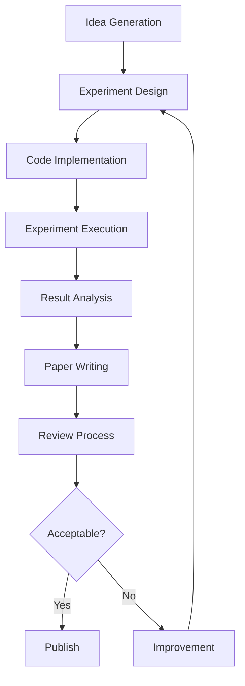
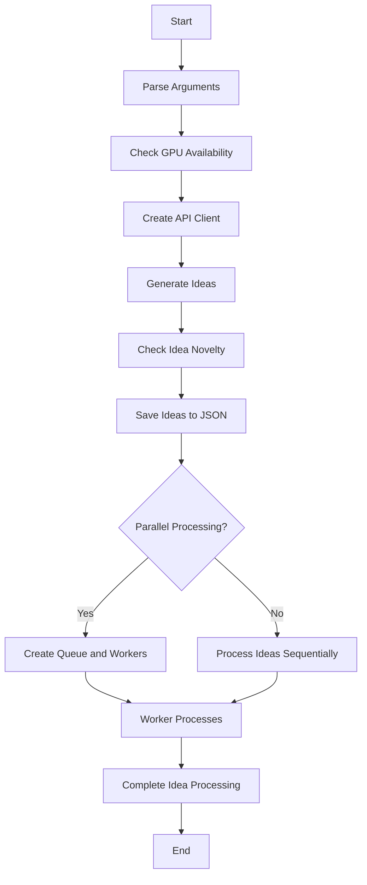

# AI Scientist Workflow

The AI Scientist is a comprehensive system for fully automatic scientific discovery. Here's a high-level overview of its workflow:

## Detailed Workflow

1. **Idea Generation** (`generate_ideas.py`)
   - Generate research ideas
   - Search for related papers
   - Check idea novelty

2. **Experiment Design**
   - Design experiments based on the generated idea
   - Define hypotheses and methodologies

3. **Code Implementation**
   - Write code to implement the designed experiments
   - Utilize appropriate frameworks and libraries

4. **Experiment Execution** (`perform_experiments.py`)
   - Run the implemented experiments
   - Collect data and results

5. **Result Analysis**
   - Analyze experimental results
   - Generate plots and visualizations

6. **Paper Writing** (`perform_writeup.py`)
   - Generate LaTeX content for the paper
   - Compile the LaTeX document into a PDF
   - Include citations and references

7. **Review Process** (`perform_review.py`)
   - Conduct a review of the generated paper
   - Provide feedback and suggestions for improvement

8. **Improvement**
   - If the paper is not acceptable, implement improvements based on the review
   - Iterate through the process again from the experiment design stage

9. **Publication**
   - If the paper is acceptable, prepare it for publication or further human review

## Key Components

- **Language Model Interaction** (`llm.py`): Handles communication with the underlying language model for various tasks throughout the workflow.
- **Experiment Templates**: Predefined templates for different types of experiments (e.g., NanoGPT, 2D Diffusion, Grokking) to facilitate rapid implementation and execution.
- **Automated LaTeX Generation**: Capability to automatically generate and compile LaTeX documents for paper writing.
- **Review and Improvement Loop**: An iterative process to refine and improve the generated scientific papers based on automated reviews.

This workflow enables the AI Scientist to autonomously conduct scientific research, from idea conception to paper writing and review, with minimal human intervention.

To map the full function flow when `launch_scientist.py` runs, we can break down the execution into key components and their interactions. Here's a structured overview of the flow:

### Function Flow Overview

1. **Main Execution**:
   - The script starts execution in the `if __name__ == "__main__":` block.

2. **Argument Parsing**:
   - `parse_arguments()` is called to retrieve command-line arguments, which include options for skipping idea generation, selecting the model, specifying the experiment type, and setting parallel processing options.

3. **GPU Availability Check**:
   - `get_available_gpus(args.gpus)` checks for available GPUs based on the provided GPU IDs or defaults to all available GPUs.

4. **Client Creation**:
   - Depending on the selected model, the appropriate API client is created (e.g., OpenAI, Anthropic) using conditional statements.

5. **Idea Generation**:
   - `generate_ideas()` is called to generate a list of research ideas based on the specified experiment template and model.
   - `check_idea_novelty()` is called to filter the generated ideas for novelty.

6. **Saving Ideas**:
   - The novel ideas are saved to a JSON file (`ideas.json`).

7. **Processing Ideas**:
   - If parallel processing is enabled, a multiprocessing queue is created, and each novel idea is added to the queue.
   - Worker processes are spawned to handle the ideas concurrently using the `worker()` function.
   - If parallel processing is not enabled, each idea is processed sequentially using the `do_idea()` function.

### Key Functions and Their Roles

- **`parse_arguments()`**:
  - Parses command-line arguments and returns them for use in the script.

- **`get_available_gpus(gpu_ids=None)`**:
  - Returns a list of available GPU IDs based on the input or all available GPUs.

- **`worker(...)`**:
  - A function that processes ideas from the queue. It retrieves an idea, performs experiments, writeups, and reviews, and logs the results.

- **`do_idea(...)`**:
  - Handles the entire workflow for a single idea, including:
    - Creating a project folder.
    - Performing experiments using `perform_experiments()`.
    - Writing up results using `perform_writeup()`.
    - Reviewing the paper using `perform_review()`.
    - Optionally improving the writeup based on reviews.

### Flow Diagram Representation

### Summary

This flow outlines how `launch_scientist.py` orchestrates the entire process from argument parsing to idea evaluation, utilizing both parallel and sequential processing as needed. Each function plays a critical role in ensuring that the AI Scientist can autonomously conduct experiments and generate scientific papers based on the provided ideas.

from dotenv import load_dotenv

# Load environment variables from .env file
load_dotenv()
