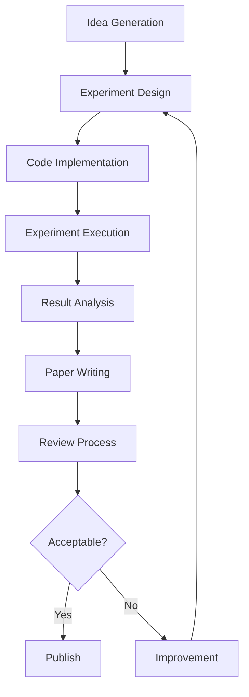

# AI Scientist Workflow

The AI Scientist is a comprehensive system for fully automatic scientific discovery. Here's a high-level overview of its workflow:

## Detailed Workflow

1. **Idea Generation** (`generate_ideas.py`)
   - Generate research ideas
   - Search for related papers
   - Check idea novelty

2. **Experiment Design**
   - Design experiments based on the generated idea
   - Define hypotheses and methodologies

3. **Code Implementation**
   - Write code to implement the designed experiments
   - Utilize appropriate frameworks and libraries

4. **Experiment Execution** (`perform_experiments.py`)
   - Run the implemented experiments
   - Collect data and results

5. **Result Analysis**
   - Analyze experimental results
   - Generate plots and visualizations

6. **Paper Writing** (`perform_writeup.py`)
   - Generate LaTeX content for the paper
   - Compile the LaTeX document into a PDF
   - Include citations and references

7. **Review Process** (`perform_review.py`)
   - Conduct a review of the generated paper
   - Provide feedback and suggestions for improvement

8. **Improvement**
   - If the paper is not acceptable, implement improvements based on the review
   - Iterate through the process again from the experiment design stage

9. **Publication**
   - If the paper is acceptable, prepare it for publication or further human review

## Key Components

- **Language Model Interaction** (`llm.py`): Handles communication with the underlying language model for various tasks throughout the workflow.
- **Experiment Templates**: Predefined templates for different types of experiments (e.g., NanoGPT, 2D Diffusion, Grokking) to facilitate rapid implementation and execution.
- **Automated LaTeX Generation**: Capability to automatically generate and compile LaTeX documents for paper writing.
- **Review and Improvement Loop**: An iterative process to refine and improve the generated scientific papers based on automated reviews.

This workflow enables the AI Scientist to autonomously conduct scientific research, from idea conception to paper writing and review, with minimal human intervention.